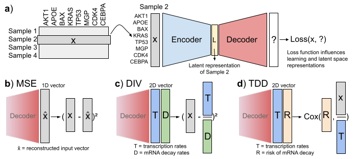
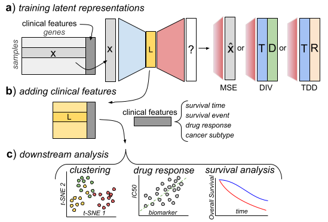

# Discovery Science 2024 // Transcription-decay decomposition loss using self-supervised CoxPH

This is code to reproduce key results and figures from the article: **Latent embedding based on a transcription-decay decomposition of mRNA dynamics using self-supervised CoxPH**.

Autoencoders are trained using different loss function.



We compare latent space representations of the models by evaluating their performance on three downstream tasks.



## Instalation

The code was tested on Ubuntu 20.04.4 LTS and MacOS 13.1. With python version 3.10.8.

Follow these steps to prepare the environment:

- Clone the repository

```bash
git clone https://github.com/MartinSpendl/DiscoveryScience24-paper.git
cd DiscoveryScience24-paper
```

- Install the required packages

```bash
# using pip in a virtual environment
pip install -r requirements.txt

# using Conda
conda create --name <env_name> --file requirements.txt
conda activate <env_name>
```

## Data

Data used for the analysis is publically accessible. Download file in the `data/raw` folder.

### The Cancer Genome Atlas datasets

TCGA datasets from UCSC Xena portal: https://xenabrowser.net/datapages/

For clustering, load Illumina gene expressions and Phenotype data:
- [TCGA-BRCA](https://xenabrowser.net/datapages/?cohort=TCGA%20Breast%20Cancer%20(BRCA)&removeHub=https%3A%2F%2Fxena.treehouse.gi.ucsc.edu%3A443 )
- [TCGA-KIRP](https://xenabrowser.net/datapages/?cohort=TCGA%20Kidney%20Papillary%20Cell%20Carcinoma%20(KIRP)&removeHub=https%3A%2F%2Fxena.treehouse.gi.ucsc.edu%3A443)
- [TCGA-LGG](https://xenabrowser.net/datapages/?cohort=TCGA%20Lower%20Grade%20Glioma%20(LGG)&removeHub=https%3A%2F%2Fxena.treehouse.gi.ucsc.edu%3A443)

For survival, load Illumina gene expressions and Survival data:
- [TCGA-KIRC](https://xenabrowser.net/datapages/?cohort=GDC%20TCGA%20Kidney%20Clear%20Cell%20Carcinoma%20(KIRC)&removeHub=https%3A%2F%2Fxena.treehouse.gi.ucsc.edu%3A443)
- [TCGA-LUAD](https://xenabrowser.net/datapages/?cohort=TCGA%20Lung%20Adenocarcinoma%20(LUAD)&removeHub=https%3A%2F%2Fxena.treehouse.gi.ucsc.edu%3A443)
- [TCGA-LGG](https://xenabrowser.net/datapages/?cohort=TCGA%20Lower%20Grade%20Glioma%20(LGG)&removeHub=https%3A%2F%2Fxena.treehouse.gi.ucsc.edu%3A443)

### METABRIC project data

Download multi-omic data from the [cBioPortal](https://www.cbioportal.org/study/summary?id=brca_metabric).

### Cancer Cell Line Encyclopedia (CCLE)

Download gene expression data and drug screening data from the [Genomics of Drug Sensitivity in Cancer](https://www.cancerrxgene.org/downloads/bulk_download).


### Genesets

L1000 geneset from the GEO project [GSE92742](https://www.ncbi.nlm.nih.gov/geo/query/acc.cgi?acc=GSE92742) is already provided in the genesets folder.

## Reproduce results

Firstly, run all the scipts in the **/scipts** directory:

```bash

cd scripts

python scripts/model-training-5-CV-CCLE-METABRIC.py --hyper-parameter-optimization

python scripts/model-training-5-CV-TCGA.py --hyper-parameter-optimization

python scripts/model-training-clustering.py --hyper-parameter-optimization
```

_Note that due to hyper-parameter optimization, the training can take from several days to weeks if CUDA is not enabled._

Secondly, run notebooks in the **/notebooks** directory.

*Figures from the notebooks are stored in the /figures directory.*
